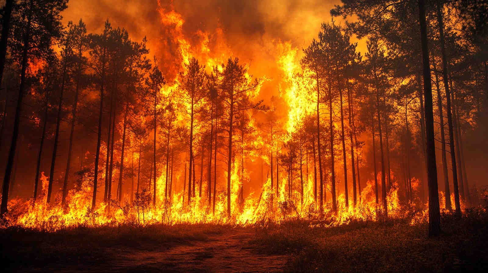
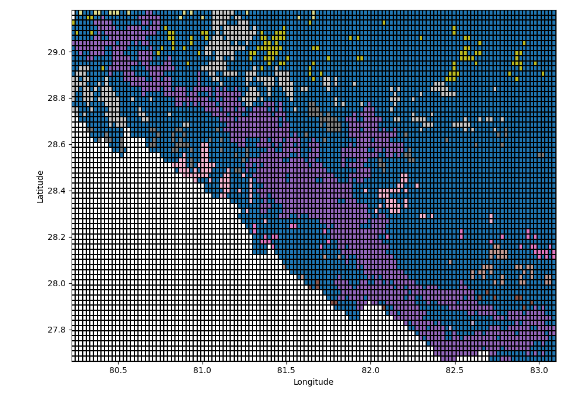
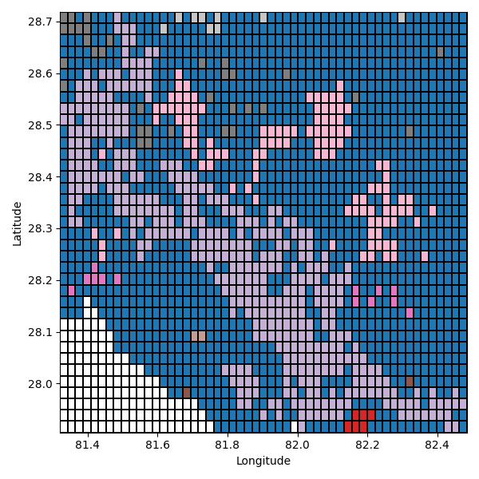
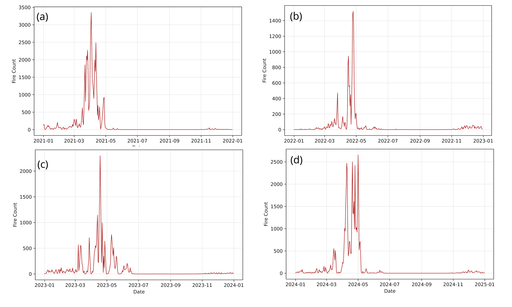
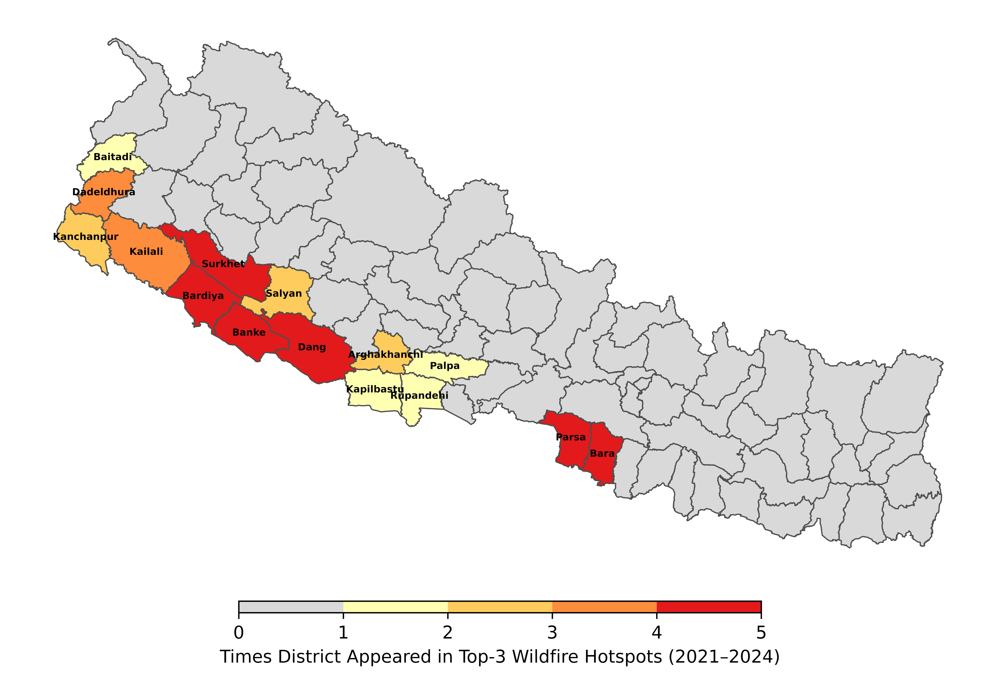
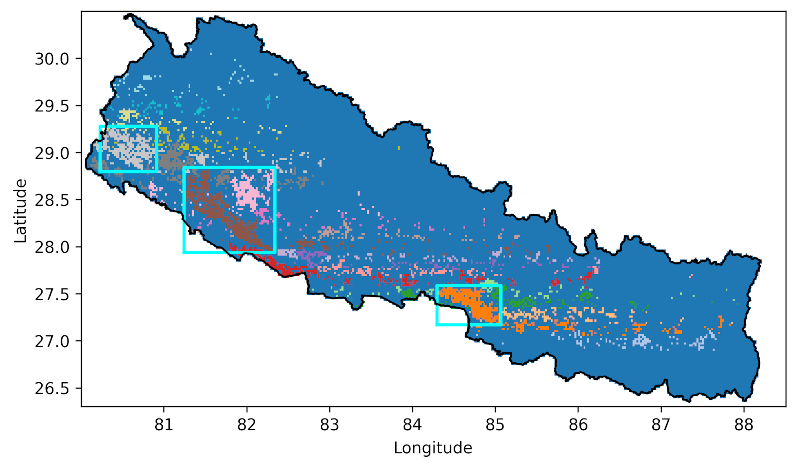

# Satellite-Based Wildfire and Air Quality Monitoring .

It combines two independent satellite data sources: NASA's VIIRS
instrument, which detects individual fire pixels from orbit every few
hours, and the European Space Agency's TROPOMI instrument, which
measures tropospheric trace gas columns daily. The pipeline grids the
raw VIIRS fire detections into a daily map of Nepal, finds the cells
with the most extreme fire activity, and groups neighboring hotspot
cells into clusters using connected-component labeling . For
each cluster, it pulls the matching NO2/CO data and deals with questions such as
how much does the gas level rise above its quiet-season baseline, and
does fire activity actually correlate with the spikes (including a day
or two of lag, since smoke takes time to accumulate and drift to the
satellite's overpass time)?

The study in Nepal where this codebase was applied is available as a preprint on EarthArXiv: Satellite-Based Clustering of Pre-Monsoon Wildfires and Variability of Tropospheric NO₂ and CO in Nepal (EarthArXiv, [10.31223/X5ZV2G](https://doi.org/10.31223/X5ZV2G))


## File overview

### Core pipeline

```
config.py                               <- shared settings: the study area's bounding box, grid resolution, years covered, file paths
01_tropomi_stac_download.py             <- downloads daily trace-gas column data (NO2, CO) for the study area from a public satellite API
02_viirs_gridding.py                    <- converts raw satellite fire-detection swaths into a daily gridded fire map
03_hotspot_detection_clustering.py      <- Connective component labeling, flags the grid cells with the most extreme fire activity and groups neighboring ones into clusters
04_cluster_trace_gas_timeseries.py      <- extracts daily trace-gas and fire-count values averaged over each cluster
```

### Reproducing the paper's results

```
06_himalaya_zone_timeseries.py          <- same kind of extraction as 04, applied to a second region of interest
07_seasonal_and_episodic_metrics.py     <- the two statistics reported in the paper (seasonal rise above baseline, and within-month volatility)
08_monthly_and_lagged_correlation.py    <- the fire-vs-gas correlation analysis behind the paper's headline numbers
09_himalaya_correlation_analysis.py     <- checks whether the signal in one region shows up in the other, with a time lag
figures/                                <- one script per published figure, for regenerating them
sample_outputs/                         <- a few of the actual figures from the paper, so you can see the output without running anything
```

## Setting it up

```bash
python -m venv .venv

# Windows
.venv\Scripts\activate
# macOS / Linux
source .venv/bin/activate

pip install -r requirements.txt
```

Then open `config.py` and point the paths at wherever your data actually
lives. Everything else imports its settings from there, so you only have
to do this once instead of editing every file.

Run things roughly in the order listed above — each stage feeds the
next one.

## How it all fits together

**Step 1-2: STAC API Pipeline to extract data within required coordinates and gridding.** `01_tropomi_stac_download.py`
downloads TROPOMI NO2/CO for Nepal from the Sentinel-5P Product
Algorithm Laboratory (S5P-PAL) data portal —
[https://data-portal.s5p-pal.com](https://data-portal.s5p-pal.com) —
the same portal the paper's Section 2.1 describes. `02_viirs_gridding.py`
takes the raw VIIRS fire swaths (the VNP14IMG product, documented at
[https://lpdaac.usgs.gov/documents/427/VNP14_User_Guide_V1.pdf](https://lpdaac.usgs.gov/documents/427/VNP14_User_Guide_V1.pdf))
and bins them onto the same ~0.022° grid so everything lines up.

**Step 3: Finding Fire hotspot using Connective Component Labeling.** `03_hotspot_detection_clustering.py`
flags grid cells with the heaviest fire activity (top 10%) and groups
neighboring hotspot cells into clusters. This is what produces the
wildfire cluster maps:




It also gives you the seasonal fire pattern:



_Daily fire counts across all four years — April is consistently the
peak month._

Geodata and Administrative Boundary Data :

The map-based figures (like the district risk map above) need
administrative boundary data to draw on — a shapefile (or
GeoPackage/GeoJSON) of the regions you want to color in. These
boundary files are **not included** in this repo, since they depend on
the area you're working with , but the examples on what you can do are shown below.



_Districts colored by how many of the 4 years they showed up in a
top-3 hotspot cluster. Bardiya, Banke, Dang, Surkhet, Parsa, and Bara
show up every single year._

## Reproducible Statistical for several cases

- `04_cluster_trace_gas_timeseries.py` — pulls daily NO2/CO averaged
  over each fire cluster's bounding box.
- `07_seasonal_and_episodic_metrics.py` — computes the two statistics
  used in the paper: how much NO2/CO rises above the Jan-Feb baseline
  during fire season (Metric A), and how spiky the day-to-day swings
  get within a month (Metric B).
- `08_monthly_and_lagged_correlation.py` — correlates fire counts
  against both metrics, and checks whether the gas signal lags the fire
  by a day or two.
- `09_himalaya_correlation_analysis.py` — checks whether the same
  fire-gas relationship shows up in the Himalaya zone too.

## Data, reproducibility, and reuse

Everything this pipeline depends on is openly available .

- **Both data sources are public and free.** The
  trace-gas data comes from the S5P-PAL data portal
  ([data-portal.s5p-pal.com](https://data-portal.s5p-pal.com)) and the
  fire detections from NASA's VNP14IMG product via LP DAAC

- **Standard formats.** Inputs and outputs use common geospatial and
  scientific formats (NetCDF, GeoTIFF, CSV, and shapefile/GeoPackage/
  GeoJSON for boundaries).

- Every analysis script maps to a specific result or figure in the paper, and the figure-generating scripts are included too, so they can be easily reused or modified as needed.

- The bounding box and dates in config.py can be changed, and the same fire-clustering and trace-gas workflow applies to any region of interest.

- If you use this code or build on it, please cite the
  accompanying preprint:
  _Satellite-Based Clustering of Pre-Monsoon Wildfires and Variability
  of Tropospheric NO₂ and CO in Nepal_, EarthArXiv,
  [10.31223/X5ZV2G](https://doi.org/10.31223/X5ZV2G).
